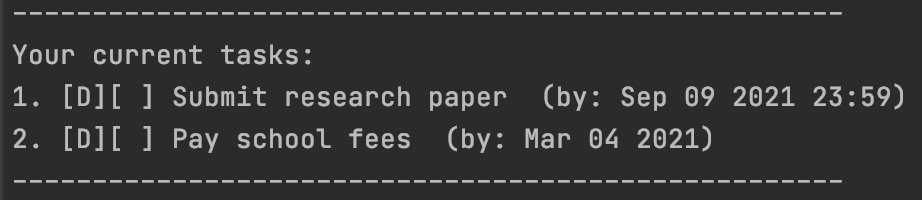
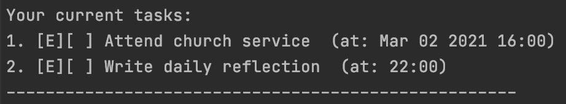
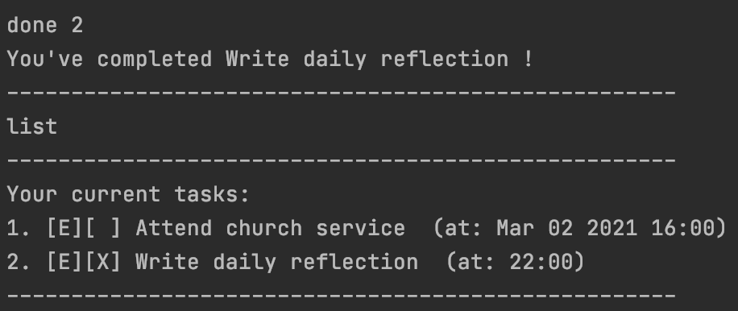
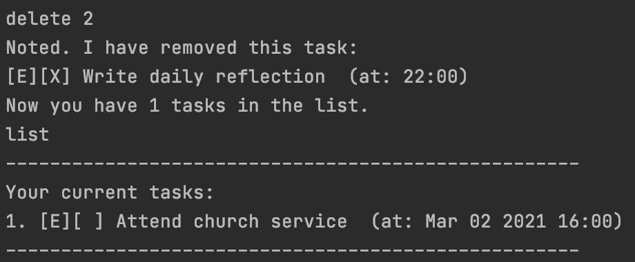
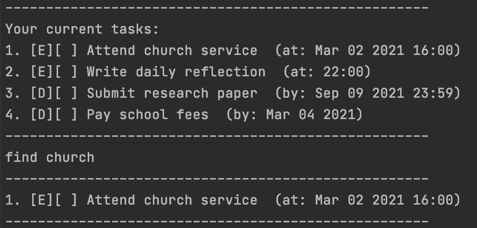

# User Guide
Duke is used for managing tasks, optimized for use via a Command Line Interface (CLI).
If you can type fast, Duke can get your task management done faster than traditional GUI apps.

# Setting up in IntelliJ
1. Ensure you have the latest version of IntelliJ installed with JDK 11. 
2. Open IntelliJ (if you are not in the welcome screen, click File > Close Project to close the existing project first)
3. Import the project into IntelliJ as follows:
   1. Click Open 
   2. Select the project directory, and click OK 
   3. If there are any further prompts, accept the defaults.
4. Configure the project to use JDK 11 (not other versions).
5. After that, locate the src/main/java/Duke.java file, right-click it, and choose Run Duke.main(). 
6. Refer to the Features below for commands you can try.

# Features
## Adding a todo: <mark style="background-color: lightblue">todo</mark>
Adds a todo to the task list. 

Format: <mark style="background-color: lightblue"> todo d/DESCRIPTION </mark>

Examples:

* <mark style="background-color: lightblue"> todo d/Return library book </mark>
* <mark style="background-color: lightblue"> todo d/Take my daily vitamins </mark>

## Adding a deadline: <mark style="background-color: lightblue">deadline</mark>
Adds a deadline to the task list. 
Datetime can be in formats <mark style="background-color: gray">yyyy-mm-dd</mark> (date),
<mark style="background-color: gray">hhmm</mark> (time) or
<mark style="background-color: gray">yyyy-mm-dd hhmm</mark> (datetime).

Format: <mark style="background-color: lightblue"> deadline d/DESCRIPTION /by t/DATETIME </mark>

Examples:

* <mark style="background-color: lightblue"> deadline d/Submit research paper /by t/2021-09-09 2359</mark>
* <mark style="background-color: lightblue"> deadline d/Pay school fees /by 2021-03-04</mark>

Expected Output:

## Adding an event: <mark style="background-color: lightblue">event</mark>
Adds an event to the task list.
Datetime can be in formats <mark style="background-color: gray">yyyy-mm-dd</mark> (date),
<mark style="background-color: gray">hhmm</mark> (time) or
<mark style="background-color: gray">yyyy-mm-dd hhmm</mark> (datetime).

Format: <mark style="background-color: lightblue"> event d/DESCRIPTION /at t/DATETIME </mark>

Examples:

* <mark style="background-color: lightblue"> event d/Attend church service /at 2021-03-02 1600</mark>
* <mark style="background-color: lightblue"> event d/Write daily reflection /at 2200</mark>

Expected Output:

## Listing all tasks: <mark style="background-color: lightblue">list</mark>
Shows a list of all tasks in the task list.

Format: <mark style="background-color: lightblue"> list </mark>

## Marking a task as done: <mark style="background-color: lightblue">done</mark>
Mark the n-th task in the task list as completed, where n is the task's index in the task list. 

Format: <mark style="background-color: lightblue"> done i/INDEX </mark>

Examples:
* <mark style="background-color: lightblue"> done 2 </mark>

Expected Output:

## Deleting a task: <mark style="background-color: lightblue">delete</mark>
Delete the n-th task in the task list, where n is the task's index in the task list.

Format: <mark style="background-color: lightblue"> delete i/INDEX </mark>

Examples:
* <mark style="background-color: lightblue"> delete 2 </mark>

Expected Output:

## Finding similar tasks: <mark style="background-color: lightblue">find</mark>
Returns all tasks in the task list that hold the input keyword.

Format: <mark style="background-color: lightblue"> find k/KEYWORD </mark>

Examples:
* <mark style="background-color: lightblue"> find church </mark>

Expected Output:

## Exiting the Program: <mark style="background-color: lightblue">bye</mark>
Exits the Program.

Format: <mark style="background-color: lightblue"> bye </mark>

# Command Summary
| Action   | Format/ Examples                                                                                                                             |
|----------|----------------------------------------------------------------------------------------------------------------------------------------------|
| todo     | todo d/DESCRIPTION e.g. todo d/Return library book                                                                                           |
| deadline | deadline d/DESCRIPTION /by t/DATETIME e.g. deadline d/Submit research paper /by t/2021-09-09 2359, deadline d/Pay school fees /by 2021-03-04 |
| event    | event d/DESCRIPTION /at t/DATETIME e.g. event d/Attend church service /at 2021-03-02 1600, event d/Write daily reflection /at 2200           |
| list     | list                                                                                                                                         |
| done     | done i/INDEX e.g. done 2                                                                                                                     |
| delete   | delete i/INDEX e.g. delete 2                                                                                                                 |
| find     | find k/KEYWORD e.g. find church                                                                                                              |
| exit     | exit                                                                                                                                         |
